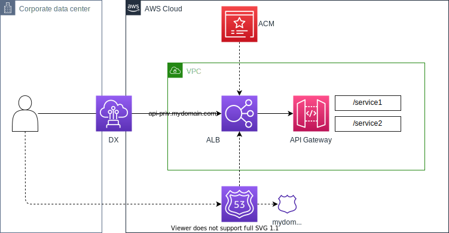

# AWS CDK Private API and Application Load Balancer Demo

This Typescript CDK project creates two private API Gateways with Lambda integrations, fronted by an ALB.

&nbsp;

The ALB has a friendly hostname and will forward requests to the API's with their internal endpoint names.

This is a workaround to use a custom domain name with an internal private API Gateway.

You can read about the concepts behind it [in this Medium article](https://markilott.medium.com/custom-dns-for-private-api-gateway-5940cb4889a8).

This Readme assumes you already have an understanding of CDK deployments.

You can deploy the stacks using CDK Deploy.

&nbsp;

## Requirements

- Route53 domain (note you can use a public or private domain)
- You will need a VPN (or Direct Connect), or a bastion/jumpbox to access to your account to test the API's after deployment.
- The demo uses the AWS default VPC by default, but you can also use your own.

&nbsp;

## Setup

Assuming you have the AWS CLI and CDK installed and configured already...

Setup the project:
- Clone the repo
- run `npm install`
- Update the `config/index.ts` file with your own environment details and preferences

&nbsp;

## Options

- `vpcId` - leave blank to use the default VPC, or enter your own VPC Id. If you enter your own you will also need to update the CIDR ranges.
- `subnetCidr1` and `subnetCidr2` (required) - we create two new subnets for the demo. The defaults are in the default VPC. If you want to use your own VPC you will need to update with valid ranges.
- `createCertificate` - we can create a new certificate for the ALB, or you can use an existing certificate. If we are creating one your Route53 zone must already include an auth record for ACM.
- `certificateArn` (required if `createCertificate` is false) - if you use an existing certificate, it must be a wildcard certificate or match the hostname you will use for the ALB
- `dnsAttr` (required) - the zone name (domain name) and zone id for your Route53 domain
- `albHostname` (required) - the hostname for your ALB
- `apiPath1` and `apiPath2` (required) - path's used in API Gateway for the domain name mapping. Must be unique.

&nbsp;

## Deployment

Use CDK to deploy:
`cdk deploy --all`

Note we are using Lookups for the VPC here. You will need to be authenticated to the correct Account in the CLI before you can run `cdk diff` or `cdk synth` the first time. After that the VPC info is saved in cdk.context and you can run offline.

&nbsp;

## Testing and Updating

You will need access over VPN/DX or bastion/jumpbox to test the ALB and APIs, as they are internal.

The stacks will output the URL's for the API's and ALB. The API outputs a request id if successful or 404 if there's something wrong.

&nbsp;

## Costs and Cleanup

The API Gateway VPC Endpoints cost ~$20/month, and the ALB ~$18/month, so make sure you destroy after testing.

Use `cdk destroy --all` or delete the CloudFormation stacks.
